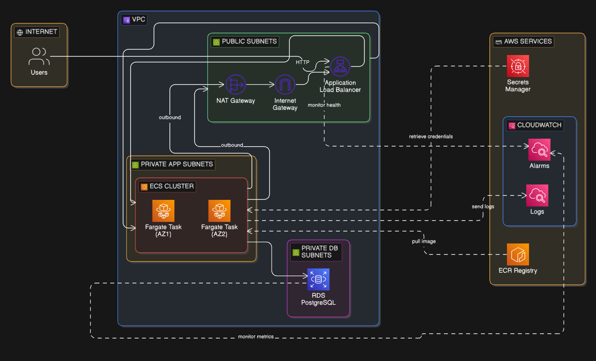
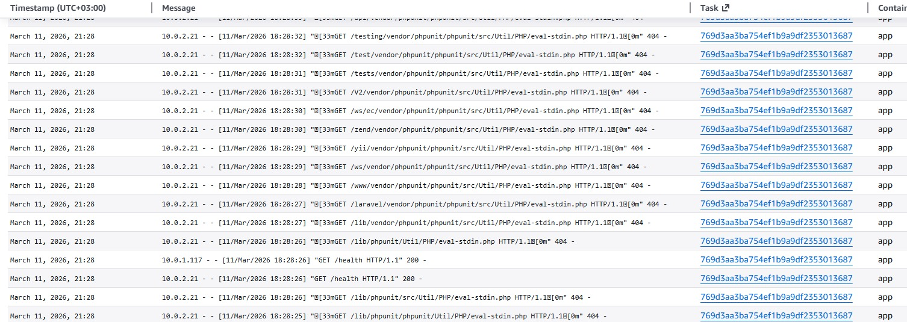
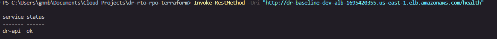
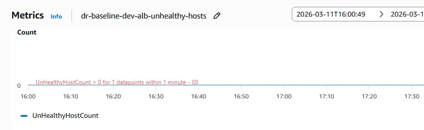

# AWS Disaster Recovery Lab – Exploring RTO/RPO Tradeoffs

This project explores real-world **Disaster Recovery (DR)** strategies on AWS by building and testing a production-style application architecture while measuring **Recovery Time Objective (RTO)** and **Recovery Point Objective (RPO)** tradeoffs.

The goal is to simulate how modern systems are designed to remain resilient during outages while understanding the architectural decisions behind recovery strategies.

This project is currently **ongoing** and will evolve through multiple phases.

---

## Project Goals

- Understand how **RTO and RPO influence architecture decisions**
- Build a **production-style application baseline**
- Deploy infrastructure using **Infrastructure as Code (Terraform)**
- Implement and compare different **Disaster Recovery strategies**
- Document real observations from testing recovery scenarios

---

## Current Progress (Phase 1 – Baseline Application)

The current phase focuses on building a **simple but realistic baseline application** that can later be used to simulate failures and recovery scenarios.

### Application Stack

- Python **Flask API**
- **PostgreSQL** database
- **Dockerized application**
- Local orchestration using **Docker Compose**

This baseline allows us to test application behavior before introducing cloud infrastructure.

---

## Current Architecture (Local Baseline)

```
Client
   │
   ▼
Flask API (Docker)
   │
   ▼
PostgreSQL Database (Docker)
```

The API exposes endpoints for:

- Health checks
- Creating items
- Listing items

This allows us to simulate **stateful workloads**, which are critical when testing RPO and RTO.

---

## Project Structure

```
dr-rto-rpo-terraform/

app/
  app.py
  requirements.txt
  Dockerfile
  .dockerignore

local/
  docker-compose.yml
  init.sql

infra/   # Terraform infrastructure (coming next)

README.md
```

---

## Running the Project Locally

### Start the services

```
cd local
docker compose up --build
```

### Health check

```
curl http://localhost:3000/health
```

### Create item

```
curl -X POST http://localhost:3000/items \
-H "Content-Type: application/json" \
-d '{"name":"first item"}'
```

### List items

```
curl http://localhost:3000/items
```

---

## Why This Baseline Matters

Before implementing Disaster Recovery strategies, it's important to establish a **controlled baseline environment**.

This application will later be used to test:

- Database recovery scenarios
- Region failover
- Infrastructure rebuild with Terraform
- Data loss scenarios affecting RPO
- Downtime measurement affecting RTO

---

### Phase 2 — Infrastructure as Code (Terraform)

In this phase, the application was deployed to **AWS using Terraform**, transforming the local baseline into a **production-style cloud architecture**.

All infrastructure is provisioned using **Infrastructure as Code (IaC)** to ensure the environment is **reproducible, version controlled, and easy to rebuild during disaster recovery scenarios**.

---

## Infrastructure Components

The following AWS resources were provisioned using Terraform.

### Networking

- **VPC** to isolate the application network
- **Public subnets** for internet-facing components
- **Private subnets** for application and database layers
- **Internet Gateway** to allow inbound internet traffic
- **Route tables** to control network traffic between layers

This setup follows a common cloud security pattern where sensitive resources remain inside **private networks**.

---

### Security

Security groups were configured to enforce **least privilege access**:

**ALB Security Group**
- Allows inbound HTTP traffic from the internet

**Application Security Group**
- Allows traffic only from the load balancer

**Database Security Group**
- Allows PostgreSQL access only from the application layer

This ensures the **database is never publicly accessible**.

---

### Load Balancing

An **Application Load Balancer (ALB)** was deployed to:

- distribute incoming traffic to the application containers
- provide health checks
- serve as the public entry point to the system

Health checks monitor the API endpoint:

```bash
/health
```

This allows the load balancer to automatically detect unhealthy containers.

---

### Containerized Application

The application is deployed using **Amazon ECS with AWS Fargate**, which allows running containers without managing servers.

Key components include:

- **ECS Cluster**
- **Task Definition**
- **Fargate Service**
- **Application container running the Flask API**

The Docker image is stored in **Amazon Elastic Container Registry (ECR)**.

This setup provides a **serverless container platform** where AWS manages compute capacity and container orchestration.

---

### Database Layer

The backend database runs on **Amazon RDS for PostgreSQL**.

Key characteristics:

- deployed in **private subnets**
- accessible only from the application containers
- supports automated backups
- designed to support later **disaster recovery experiments**

This database stores the **stateful data** used for measuring **Recovery Point Objective (RPO)** during failure simulations.

---

## Resulting Architecture (AWS)

The deployed cloud architecture now follows a **three-tier pattern**:

```bash
Internet
│
▼
Application Load Balancer
│
▼
ECS Fargate Service (Flask API containers)
│
▼
Amazon RDS PostgreSQL
```




This architecture resembles real-world production systems and provides the foundation for testing **disaster recovery scenarios**.

---

## Why Terraform Was Used

Terraform enables:

- **Version-controlled infrastructure**
- **Automated environment rebuilds**
- **Consistent deployments**
- **Faster disaster recovery testing**

In later phases, this will allow entire environments to be **destroyed and recreated to simulate recovery scenarios** and measure **actual RTO values**.

---

## Outcome of Phase 2

At the end of this phase:

- The application runs on **AWS ECS Fargate**
- Traffic flows through an **Application Load Balancer**
- Data is stored in **Amazon RDS PostgreSQL**
- Infrastructure can be recreated **fully using Terraform**

The system is now ready for **observability and disaster recovery experiments**.

---

### Phase 3 — Observability

In this phase, observability is introduced to better understand how the system behaves in production and during failure scenarios.

Observability is critical for **disaster recovery experiments**, because it allows us to measure system health, detect failures quickly, and observe how long recovery processes take.

The focus in this phase is on **logging, monitoring, and health visibility** using AWS-native tools.

---

## CloudWatch Logs

Application logs from the ECS containers are sent to **Amazon CloudWatch Logs**.

This allows us to:

- monitor application behavior in real time
- troubleshoot errors during deployment
- inspect logs when simulating failures
- verify successful API requests and database operations

CloudWatch provides a centralized logging system where logs from containers can be searched and analyzed.




---

## Health Checks

Health checks ensure that the application is **responding correctly** and help detect failures automatically.

The **Application Load Balancer (ALB)** continuously checks the API endpoint:

If the container stops responding or returns an unhealthy status:

- the load balancer will mark the task as **unhealthy**
- ECS can automatically replace the failing container

This mechanism is essential for maintaining **high availability** in containerized workloads.



---

## Application Metrics

Metrics provide insight into the performance and behavior of the system.

Using **CloudWatch metrics**, we can monitor:

- request traffic through the load balancer
- container health and task status
- system availability
- potential error spikes

These metrics will be especially useful in later phases when measuring **Recovery Time Objective (RTO)** during simulated outages.



---

## Why Observability Matters for Disaster Recovery

Observability enables us to measure the effectiveness of disaster recovery strategies.

By combining:

- logs
- metrics
- health checks

we can accurately determine:

- how quickly failures are detected
- how long systems take to recover
- whether any data loss occurred

This information will be used in later phases to evaluate **RTO and RPO tradeoffs** during disaster recovery simulations.

---

## Next Steps (Upcoming Phases)
### Phase 4 — Disaster Recovery Scenarios

Test and document:

- RDS backup and restore
- Multi-AZ database failover
- Multi-region replication
- DNS failover strategies
- Infrastructure rebuild using Terraform

Each experiment will include **measured RTO and RPO results**.

---

## Learning Focus

This project is helping me deepen my understanding of:

- Cloud architecture
- Infrastructure as Code
- Containerized applications
- AWS networking
- Disaster recovery planning

---

## Author

Belinda Ntinyari

AWS Cloud Engineer  
Building production-style cloud systems and documenting the learning journey.

## Connect With Me

LinkedIn:  
https://www.linkedin.com/in/belinda-ntinyari

Medium:  
https://medium.com/@ntinyaribelinda